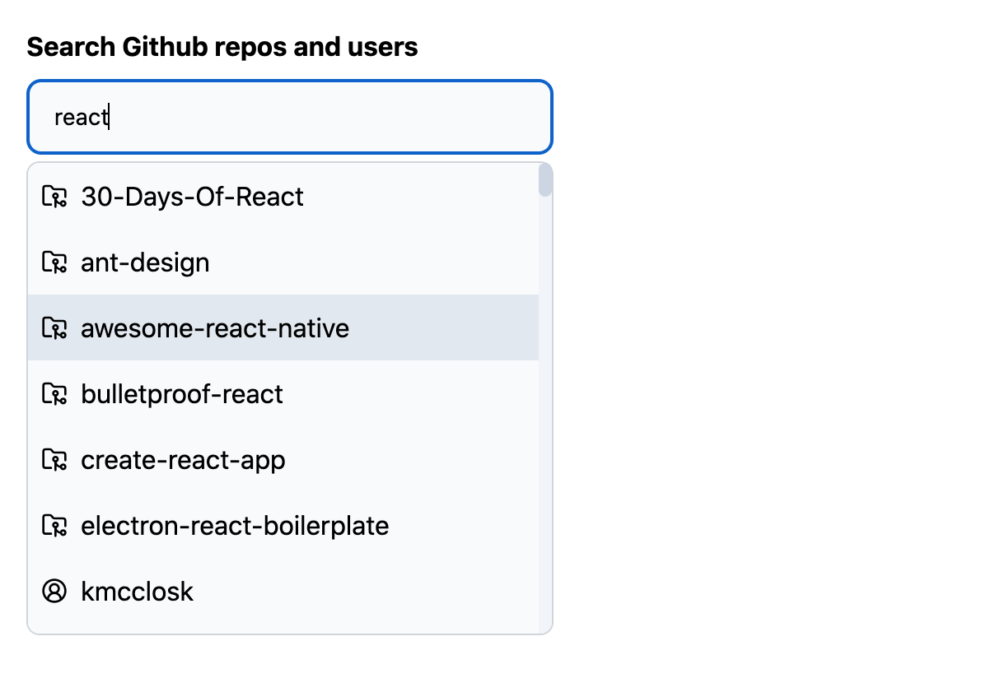

# Makers' Den coding challenge

Autocomplete component that allows searching public repositories and users using Github REST API.



This project is created with [TypeScript](https://www.typescriptlang.org/), [React](https://react.dev/),
[Vite](https://vitejs.dev/) and [TailwindCSS](https://tailwindcss.com/).

## Project structure and purpose

Main components:

1. `<Autocomplete>` - Generic component that can render any asynchronous data. Handles input field, displaying dropdown, keyboard navigation etc.
2. `<GithubSearch>` - Github search with autocomplete that builds on top of generic `<Autocomplete>` by adding domain-specific data (Github API in this case).

Structure overview:

```
src
├─ main.tsx              // React app entry point
├─ api                   // Github API
├─ components
│  ├─ common
│  │  └─ Autocomplete    // generic Autocomplete component
│  └─ GithubSearch       // Github search that builds on top of Autocomplete component
└─ hooks                 // utility hooks for debouncing and DOM
```

## Running this project

Prerequisites

- Node v20.x.x

### Setting up environment:

1. Create `.env` file in the **root directory**
2. Put your [Github access token](https://docs.github.com/en/rest/authentication/authenticating-to-the-rest-api?apiVersion=2022-11-28#authenticating-with-a-personal-access-token) in the `.env` file:

```
VITE_GITHUB_TOKEN=your_token_here
```

Without `VITE_GITHUB_TOKEN` environment variable this app won't start or build. It will throw following error:

```
Error: VITE_GITHUB_TOKEN env variable is missing
```

### Installing dependencies

This project is using `npm`. To install dependencies run:

```
npm install
```

### Running

To start local development server run:

```
npm run dev
```

It will start on [http://localhost:5174/](http://localhost:5174/) by default.

Building for production (static files):

```
npm run build
```

Run tests:

```
npm run test
```
